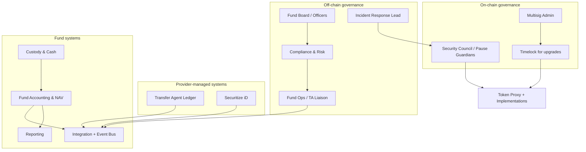
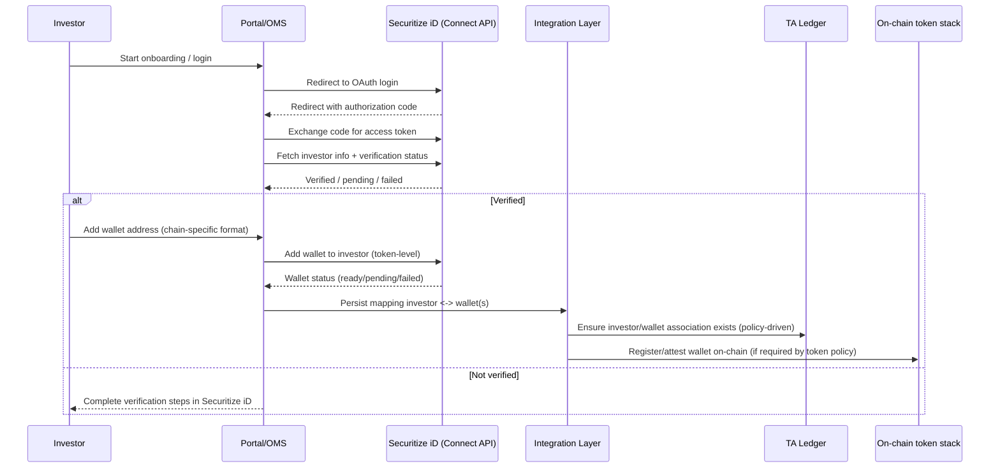
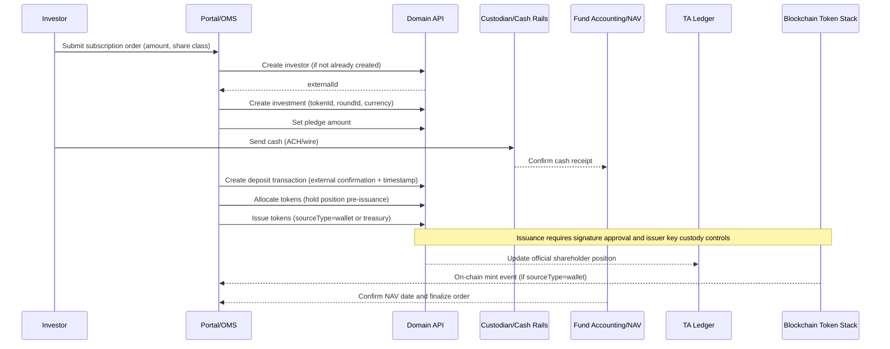
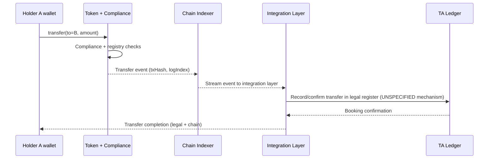
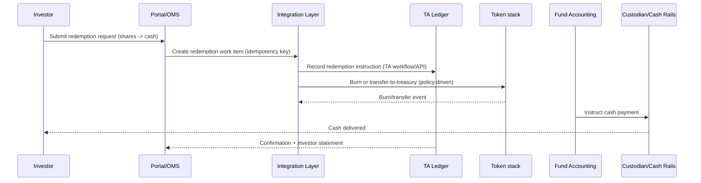
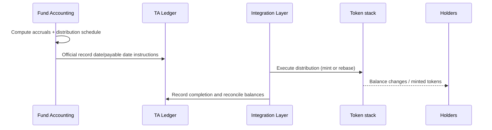
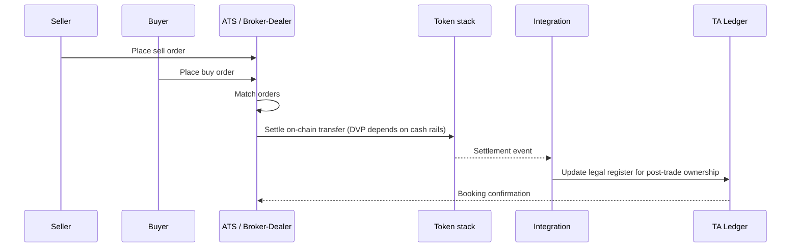
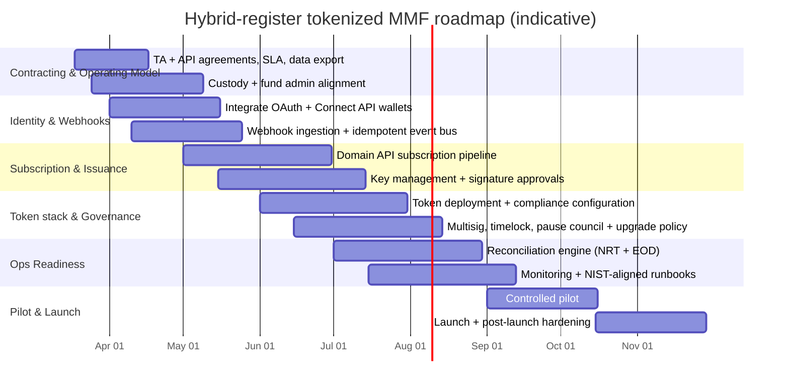

# Hybrid-register architecture for a tokenized US money market fund using Securitize

## Executive summary

[Download the Markdown report](sandbox:/mnt/data/hybrid_register_us_mmfund_securitize.md)  
To download: open the link and save the file locally (it is a single `.md` document with Mermaid diagrams and tables).

This report specifies a full **hybrid-register** target architecture for a **tokenized US money market fund** in which:

- **Securitize** is used as the regulated **Transfer Agent / Digital Transfer Agent** and tokenization provider, while the on-chain layer provides programmable settlement and controlled transfers.
- The **legal shareholder register** remains in the **transfer agent ledger**, consistent with the entity["organization","U.S. Securities and Exchange Commission","federal securities regulator"] view that transfer agents record changes of ownership and maintain securityholder records (and sit at the center of secondary trade completion). citeturn2search0turn2search4
- A dedicated **integration + reconciliation layer** provides event-driven synchronization between (i) the transfer agent ledger and (ii) blockchain events, with audit-grade evidence, exception handling, and operational controls aligned to transfer agent recordkeeping requirements. citeturn1search7turn1search3
- Fund operations (portfolio constraints, liquidity management, NAV calculation, SEC filings) remain predominantly off-chain, driven by Rule 2a‑7 and reporting obligations including **Form N‑MFP** (monthly, due by the fifth business day) and **Form N‑CR** (material events; instructions indicate filing generally within one business day and immediate public availability upon filing). citeturn1search0turn1search1turn1search14

Technical foundations (prioritized primary sources) are anchored in:
- Securitize official **Domain API** (end-to-end subscription/issuance workflow with explicit `sourceType=wallet|treasury` semantics and an issuer signature step). citeturn6view1turn12view0
- Securitize official **Webhooks API** (event discovery, subscription lifecycle, payload structure, and supported event types including KYC updates and subscription agreement updates). citeturn11view0turn12view2
- Securitize official **Connect API** (Securitize iD) for OAuth-based investor login and wallet management; wallet address format depends on the underlying blockchain. citeturn0search1turn0search5turn0search9
- The publicly available **DSToken v4** implementation details: role separation (Master/Issuer/Exchange/Transfer Agent), compliance gating, registry service (hashed investor data + confirmed wallets), upgradeability via OpenZeppelin ERC1967 proxy, operational controls (pause/lock/seize/burn), and rebasing provider for dividend accrual patterns; deployment can be done on any compatible EVM chain, and migrations can be gas-intensive. citeturn7view5turn7view3turn6view0

Operational resilience and incident response are aligned to entity["organization","National Institute of Standards and Technology","us standards agency"] guidance in SP 800‑61r3 (incident response embedded into cyber risk management and continuous improvement). citeturn2search2turn2search6turn2search21

## Scope and explicit assumptions

### What is explicitly unspecified

The following items are **UNSPECIFIED** and must be decided before formalizing implementation specifics:

- **Blockchain choice and execution environment**: EVM vs non‑EVM, finality model, sequencing, cost/fee economics, node strategy, and indexer behavior (reorg handling). (The design below is chain-agnostic, but DSToken-as-is is EVM-oriented.) citeturn7view3turn0search5
- **Fund classification**: government vs prime vs municipal; retail vs institutional; stable NAV vs floating NAV. Relevant because SEC reforms require floating NAV for certain institutional prime money market funds. citeturn5search4turn5search1
- **Distribution model**: direct accounts vs intermediaries/omnibus; whether wallets map 1:1 to investors or support multiple wallets per investor. (Securitize Connect API supports investor wallet lists by token.) citeturn0search5turn6view1
- **Custodian and fund administrator**: bank/qualified custodian identity, cash rails, settlement cutoffs, NAV engine platform, and reporting tooling.
- **Secondary trading**: whether enabled, and if so whether via entity["company","Securitize Markets","registered broker-dealer and ats"] or another ATS/broker-dealer arrangement. (Reg ATS/BD obligations apply; Form ATS filing is required under Reg ATS.) citeturn2search22turn2search3turn3search1
- **Cash rails**: Fedwire/ACH only vs additional tokenized cash/stablecoin “off-ramp” patterns (e.g., the Circle “fund shares → USDC” pattern is an optional reference design, not a baseline requirement). citeturn3search3

### Baseline regulatory assumption used in this report

Unless your program specifies otherwise, the baseline target is:

- A **US registered open-end management investment company** regulated as a **money market fund under Rule 2a‑7** (risk-limiting conditions, liquidity constraints, and related reporting). citeturn1search0turn5search3

If you are instead building a private “money-market-like” product (common in some tokenized treasury offerings), the architecture is similar but the compliance perimeter differs (eligibility, filings, distribution restrictions).

## Regulatory baseline and obligations

### Transfer agent duties and why they directly affect architecture

The SEC describes transfer agents as entities that **record changes of ownership**, **maintain issuer securityholder records**, and **distribute dividends**, and notes they are critical to the completion of secondary trades. citeturn2search0turn2search4

Architecture implications in a tokenized context:

- If the on-chain token is **not** legally designated as the shareholder register, then the transfer agent ledger must remain the **legal system of record** and blockchain transfers must be **reflected** (or confirmed) in that ledger.
- The platform must implement **audit-grade evidence**, deterministic replay, and controlled access consistent with transfer agent recordkeeping rules (including electronic storage requirements). citeturn1search7turn1search3turn2search8

### Transfer agent performance standards and recordkeeping constraints

Two sets of SEC transfer agent rules are “architecture-shaping”:

- **Turnaround standard (Rule 17Ad‑2)**: requires transfer agents to turn around at least 90% of routine items within three business days (with detailed timing conventions). citeturn2search1turn2search13
- **Recordkeeping/electronic storage (Rule 17Ad‑7)**: SEC guidance emphasizes electronic storage mechanisms must ensure accessibility, security, and integrity; detect attempts to alter/remove records; and provide recovery means. Additional requirements include escrow of information needed to access records (including format/source code documentation for electronic storage). citeturn1search7turn1search3turn1search15

These constraints motivate (a) an event-driven integration layer with immutable audit logs and (b) explicit operational SLAs between your fund complex and the transfer agent/provider.

### Money market fund obligations that drive the operating model

Rule 2a‑7 constrains portfolio risk and liquidity. Current sources and SEC reforms describe minimum liquidity thresholds including **daily** and **weekly** liquid asset minimums (e.g., 25% daily and 50% weekly in current rules/updates). citeturn1search0turn5search3turn5search13

SEC reforms also affect operating assumptions:
- 2023 reforms increased liquidity minimums and removed redemption gate provisions in current rule structure. citeturn5search5turn5search3
- 2014 reforms introduced floating NAV for certain institutional prime funds and associated tools (fees/gates), with specifics described in SEC materials and Federal Register publications. citeturn5search4turn5search1turn5search7

Operationally, this means NAV/yield calculations, liquidity buffers, and board governance stay off-chain; on-chain components should not be the portfolio risk engine.

### Reporting obligations

- **Form N‑MFP**: SEC indicates N‑MFP is filed by the fifth business day of the month; the form instructions further specify timing and “as of” holdings. citeturn1search1turn1search5
- **Form N‑CR**: Form instructions state when events occur the report is typically due within one business day and becomes public immediately upon filing. citeturn1search14turn1search2

This requires a filing-ready reporting pipeline with strong governance around data quality, sign-offs, and incident escalation.

### Secondary trading baseline when an ATS is used

Regulatory anchors for ATS:
- SEC explains that to comply with Regulation ATS, an ATS must register as a broker-dealer and file Form ATS (and must keep it updated). citeturn2search22
- entity["organization","FINRA","us self-regulatory org"] guidance defines ATSs as SEC-regulated venues; broker-dealer obligations apply and FINRA oversight applies for BD-registered ATS operators. citeturn2search3turn2search37

If you decide to enable secondary trading, surveillance, supervision, recordkeeping, and customer protection requirements must be designed into the operating model.

## End-to-end hybrid-register architecture

### Hybrid-register definition used in this report

A **hybrid register** means there are **two synchronized representations of ownership**:

- **Transfer agent ledger**: the **legal shareholder register** for investor positions (identity-based accounts, official “book” of record).
- **On-chain token ledger**: an **operational representation** of eligible ownership positions held by wallets, with strong compliance gating.

A critical nuance is that DSToken also includes an on-chain **Registry Service** used for compliance (hashed investor data + confirmed wallets), but this is not necessarily the “legal shareholder register” unless explicitly re-designated by legal/regulatory strategy. citeturn6view0turn7view3turn2search0

### End-to-end system architecture diagram

```mermaid
flowchart LR
  %% Actors
  INV[Investor / Advisor] --> UI[Investor Portal / OMS]
  PM[Portfolio Mgmt / Adviser] --> FA[Fund Accounting & NAV Engine]
  BOARD[Fund Board & Officers] --> GOV[Governance & Policies]

  %% Securitize identity + issuer APIs
  UI -->|OAuth login| ID[Securitize iD / Connect API]
  UI -->|Issuer workflows| DOM[Securitize Domain API]
  DOM --> TA[Transfer Agent Ledger]
  DOM --> WH[Webhook Service]

  %% Integration & data plane
  WH --> INT[Integration Layer: API Gateway + Event Bus + Orchestrator]
  TA --> INT
  ID --> INT
  INT --> AUD[Evidence Vault / Audit Log]

  %% Cash & custody
  UI --> PAY[Cash Rails: Fedwire/ACH; optional stablecoin bridge]
  PAY --> CUST[Custodian Bank / Qualified Custodian]
  CUST --> FA

  %% Blockchain plane
  INT --> NODE[Blockchain Node / RPC Provider]
  NODE --> IDX[Chain Indexer / Event Stream]
  IDX --> TOK[On-chain Security Token Stack (DSToken-like)]
  TOK --> IDX

  %% Reporting
  FA --> REP[SEC Reporting Pipeline (N-MFP, N-CR)]
  TA --> STMT[Investor Statements / Confirmations]
  STMT --> INV
  REP --> REG[SEC / EDGAR]

  %% Monitoring
  INT --> OBS[Observability: logs/metrics/traces]
  TOK --> OBS
  IDX --> OBS
```

This diagram reflects Securitize’s published separation of: (i) Connect API (identity and wallet management), (ii) Domain API (issuer workflows for investments/issuance), and (iii) Webhooks (real-time event notifications). citeturn0search0turn0search9turn6view1turn11view0

### Governance architecture diagram



This governance model is consistent with (a) DSToken’s explicit separation between issuance roles and compliance roles (including a Transfer Agent role) and (b) the need for emergency controls (pause/unpause) and conservative upgrade governance around ERC1967 proxies. citeturn7view5turn7view3turn4search6turn4search9turn4search0

### Component catalog with implementation notes

The table below is deliberately explicit about what is grounded in public sources vs what remains program-dependent.

| Domain | Component | Function | Implementation notes and source grounding |
|---|---|---|---|
| Securitize | Connect API (Securitize iD) | OAuth login, identity/verification status, wallet management | Docs describe OAuth-based authentication with redirect URL whitelisting and access tokens; Connect API is presented as RESTful KYC/KYB/AML integration. citeturn0search1turn0search23turn0search9turn0search15 |
| Securitize | Connect API Wallets | Wallet list and wallet add per token; wallet status | Docs state wallet address format depends on blockchain (EVM vs other). citeturn0search5 |
| Securitize | Domain API | Investment lifecycle: create investor, investment, pledge, transaction, allocation, issuance | Public “end-to-end investment” doc provides exact endpoints and step order. citeturn6view1turn12view0 |
| Securitize | Issuance semantics | `sourceType=wallet` vs `sourceType=treasury` + signature step | Public doc defines `treasury` as Securitize internal book-entry system (TBE) and notes issuance requires signature approval and issuer private key control. citeturn12view0 |
| Securitize | Webhooks API | Events discovery + subscriptions lifecycle + payload shape | Public docs show GET events, subscribe, list, update, delete; supported events include KYC update and subscription agreement update; payload contains domainId/externalId/tokenId/roundId where relevant, plus nonce. citeturn11view0turn12view2turn12view3 |
| On-chain | Security token stack (DSToken-like) | ERC-20 compatible security token in regulated environment | DSToken readme: ERC-20 compatible superset, uses Registry + Compliance; can be deployed to any compatible EVM chain and behind ERC1967 proxy. citeturn7view3turn6view0 |
| On-chain | Trust Service roles | Master/Issuer/Exchange/Transfer Agent roles and separation | DSToken v4 defines Transfer Agent role to manage compliance and token-level configuration (freeze/unfreeze), preserving separation between issuance and compliance. citeturn7view5 |
| On-chain | Compliance Service | Rules enforcement for issuance/transfer/burn and blacklisting | DSToken describes compliance management and dedicated blacklist manager; the token relies on compliance checks to restrict transfers to authorized investors. citeturn7view3turn7view5 |
| On-chain | Registry Service | Hash-based investor data + confirmed wallets | DSToken explicitly states personal data is stored hashed on-chain and includes investor registry + confirmed wallets. citeturn6view0 |
| On-chain | Operational controls | Mint, burn, seize, lock, pause | DSToken lists issuance, burning, seizing, locking, and trade pausing by Master. citeturn7view3 |
| On-chain | Upgrade mechanism | ERC1967 proxy-based upgradeability | DSToken deploys behind OpenZeppelin ERC1967 proxy; EIP-1967 defines standard proxy storage slots; OpenZeppelin warns upgradeable proxies are difficult and require deep understanding. citeturn7view3turn4search6turn4search9 |
| Fund complex | Portfolio management | Manage portfolio within Rule 2a‑7 constraints | Rule 2a‑7 liquidity minimum requirements and risk constraints shape NAV and liquidity operations. citeturn1search0turn5search3turn5search13 |
| Fund complex | Fund accounting + NAV engine | NAV, yield accruals, record dates, accounting data feeds | N‑MFP and N‑CR requirements imply strong data pipelines and deadlines. citeturn1search1turn1search14 |
| Fund complex | Custody + cash rails | Confirm subscription cash; pay redemptions | Custody integration is essential to prevent issuance-before-cash and to control redemption settlement. (Custody pattern illustrated in institutional tokenized fund references such as BUIDL.) citeturn3search2 |
| Fund complex | Integration layer | Orchestrate synchronization, reconciliation, audit evidence | Must satisfy TA recordkeeping properties (integrity, detect alteration attempts, recoverability) and provide deterministic replay. citeturn1search7turn1search3 |
| Fund complex | Reporting pipeline | N‑MFP monthly, N‑CR event-driven | SEC specifies N‑MFP timing; N‑CR form instructions specify event filing windows and public availability. citeturn1search1turn1search14 |

## Flows and integration contracts

### Onboarding sequence flow



This flow is grounded in Connect API OAuth documentation and Wallets endpoints (including explicit statement that address format depends on blockchain). citeturn0search1turn0search23turn0search5turn0search9

### Subscription and issuance sequence flow

Securitize Domain API documents an explicit “end-to-end investment experience” with these steps: create investor → create investment → set pledge amount → create transactions → allocate tokens → issue tokens. citeturn6view1turn12view0



The `sourceType=wallet` vs `sourceType=treasury` distinction (treasury = internal book-entry system) and the “signature required” step are explicitly documented, and are critical design hooks for hybrid-register and key governance. citeturn12view0

### Transfer sequence flow

DSToken v4 enforces compliance by requiring that tokens can only reside in authorized wallets and by using Registry + Compliance services. citeturn7view3turn6view0turn7view5

**Important: booking the legal register for P2P transfers is UNSPECIFIED in public Domain API docs**; Domain API documentation focuses on subscription/issuance. Therefore, the “TA booking” step below is an integration workstream requiring either (a) an additional Securitize TA process/API not described in public docs or (b) a constrained transfer model where transfers are mediated by roles/venues that also submit transfer instructions to TA operations.



### Redemption sequence flow

Public Securitize docs provide detailed issuance flows but do not document public redemption endpoints in the same way; redemption APIs/processes are therefore **UNSPECIFIED** in public materials. citeturn12view0

The architecture below defines a robust operational model that can be implemented via TA processes and fund admin workflows:



### Corporate actions sequence flow

DSToken includes a “rebasing provider” to support “dividend accrual, splits, reverse splits” efficiently. citeturn7view0turn7view1  
Institutional tokenized fund examples (e.g., BUIDL) describe dividend accrual and token-based distribution patterns, which can be treated as optional reference implementations rather than mandatory design choices for a regulated 2a‑7 fund. citeturn3search2turn3search35



### Secondary trading sequence flow

If secondary trading is enabled through an ATS, regulatory obligations broaden. SEC states an ATS must register as broker-dealer and file Form ATS, and FINRA guidance describes ATS oversight and BD obligations. citeturn2search22turn2search3

Securitize has public statements and filings indicating it is an SEC-registered transfer agent and that Securitize Markets operates as a broker-dealer/ATS (details in public comment materials and press releases). citeturn3search0turn3search1turn3search36



### Securitize interface contracts grounded in public docs

#### Webhooks API endpoints and payloads

Securitize’s webhooks guide documents:
- GET `/v1/webhooks/events` to list events
- POST `/v1/webhooks/subscriptions` to subscribe
- GET `/v1/webhooks/subscriptions?...` to list and GET by subscription ID
- PATCH to update
- DELETE to remove subscriptions citeturn11view0

It also lists supported events (at least `domain-investor-kyc-update` and `domain-investor-subscription-agreement-update`) and indicates webhook POST payload fields including `domainId`, `externalId`, `eventType`, `subscriptionId`, `nonce`. citeturn12view2turn12view3

#### Domain API investment and issuance endpoints

The “end-to-end investment experience” guide documents exact endpoints (create investor/investment, pledge amount, deposit transactions, allocation, issuance) and explicitly defines `sourceType=wallet|treasury`, plus the signature step requiring issuer wallet address and private key. citeturn6view1turn12view0

#### Connect API authentication and wallet endpoints

Connect API docs describe OAuth authentication details and prerequisites (domainID/issuerID, OAuth secret, base URL for sandbox/prod), and wallet endpoints including wallet status and chain-dependent address formats. citeturn0search1turn0search5turn0search14

### Canonical internal message/queue contracts

Because webhooks can be retried and ordering cannot be guaranteed, an internal event envelope should enforce idempotency and replay.

**Proposed internal event envelope (design recommendation):**

```json
{
  "eventId": "uuid-or-hash",
  "source": "securitize-webhook|securitize-domain|chain-indexer|custodian|nav-engine",
  "type": "InvestorKycUpdated|SubscriptionAgreementUpdated|SubscriptionCashConfirmed|TokensIssued|OnchainTransferObserved|TokensBurned|NavPublished|ReconciliationMismatchDetected",
  "occurredAt": "ISO-8601 timestamp",
  "correlation": {
    "domainId": "string",
    "externalId": "string",
    "tokenId": "string",
    "roundId": "string",
    "wallet": "string",
    "txHash": "string",
    "logIndex": "int"
  },
  "payload": { "..." : "..." }
}
```

Correlation keys `domainId`, `externalId`, `tokenId`, `roundId` are directly grounded in Securitize webhook payloads and Domain API semantics; chain keys (`txHash`, `logIndex`) are required to make event processing idempotent and unambiguous. citeturn12view2turn6view1

## Controls, reconciliation, and operations

### Role model and security controls

DSToken v4 provides an explicit role separation and control set:

- Trust Service roles: **Master**, **Issuer**, **Exchange**, and **Transfer Agent** (new in v4), with Transfer Agent role explicitly designed to manage compliance rules and freeze/unfreeze capabilities, keeping issuance and compliance distinct. citeturn7view5
- Token-level controls include issuance (mint), burning, seizing, locking, and trade pausing (pause/resume by Master). citeturn7view3turn7view1
- The main token contract is deployed behind a **proxy** (OpenZeppelin ERC1967 implementation) enabling upgrades, and the readme warns deployment/migration can be gas-intensive. citeturn7view3turn7view0

Recommended governance mapping (design recommendation, grounded in those primitives):
- **Issuer** key: controlled by fund officers/authorized signers; used for issuance/burn operations.
- **Transfer Agent** role: controlled by TA operations/compliance (Securitize), used for compliance configuration and freezes.
- **Master** role: controlled by a security council/multisig with strong operational procedures for pause/unpause.
- **Exchange** role: only granted to regulated venues/intermediaries authorized to onboard investors and interact with compliance gating.

### Key management and signing controls

Securitize’s Domain API flow explicitly states issuance requires signature approval and the issuer’s wallet address/private key. This necessitates formal key custody controls and segregation of duties between operations and security. citeturn12view0turn6view1

Recommended key management posture (design recommendation):
- HSM/MPC-backed signing, dual control, break-glass procedures, rotation, and separate keys for issuance vs pause vs upgrades.

### Upgrade policy and emergency pause

- DSToken uses OpenZeppelin ERC1967 proxy, and EIP‑1967 defines standardized proxy storage slots for implementation/admin/beacon discovery and tooling compatibility. citeturn7view3turn4search6
- OpenZeppelin’s proxy documentation explicitly warns that using upgradeable proxies correctly and securely is difficult and requires deep knowledge. citeturn4search9
- OpenZeppelin’s Security Council best practices guide provides a structured approach for balancing rapid emergency action with accountability. citeturn4search0

Therefore, an institutional-grade upgrade policy should include:
- staged deployments (dev → testnet → prod),
- independent audits for any upgradeable implementation changes,
- a timelock for upgrades,
- emergency pause authority with clear runbooks and post-incident review.

### Reconciliation model

Reconciliation must explicitly account for **hybrid issuance modes**:

- If `sourceType=wallet`, shares are represented on-chain (mint to investor wallet).
- If `sourceType=treasury`, shares may remain in Securitize’s internal book-entry (TBE) and might not be visible in on-chain balances. citeturn12view0

Recommended reconciliations:

**Near-real-time controls**
- Webhook subscription liveness and nonce progression monitoring (detect gaps).
- Chain indexer lag/reorg monitoring (UNSPECIFIED by chain; must be implemented per chosen chain).
- Subscription invariant checks: cash confirmed → Domain API transaction recorded → allocation holds → issuance executed/signed → TA ledger updated.

**End-of-day close**
- TA ledger outstanding shares vs on-chain `totalSupply` plus any non-on-chain/TBE balances (if applicable).
- Investor↔wallet mapping integrity (Connect API wallet list vs internal mapping vs on-chain Registry Service confirmed wallets).
- Cash and shares reconciliation for subscriptions and redemptions.

### Exception classes and runbooks

Below is an actionable exception taxonomy (design recommendation) aligned to the known failure modes of webhooks, chain indexing, issuance signing, and dual-ledger synchronization.

| Exception | Detection signal | Immediate containment | Resolution steps |
|---|---|---|---|
| Webhook delivery failure or lag | nonce gaps; time since last webhook exceeds threshold | switch critical checks to polling endpoints; alert ops | revalidate webhooks subscriptions; replay queue; reconcile against “source of truth” APIs (e.g., GET KYC status) citeturn11view0turn0search2 |
| Chain event observed but TA not updated | chain transfer event with no TA booking within SLA | freeze involved wallets / pause trading if systemic | replay chain events; open TA operations case; execute legal booking or forced remediation (policy-driven) citeturn7view5turn2search0 |
| TA updated but chain issuance not final | issuance pending signature; chain tx failure | halt further allocations; expose “stuck issuance” queue | re-execute signing workflow; retry tx; ensure idempotency using txHash/logIndex citeturn12view0turn7view3 |
| Post-factum KYC invalidation | webhook `domain-investor-kyc-update` | freeze affected wallets | enforce remediation per policy and document in evidence vault; update records citeturn0search2turn7view5 |
| NAV publication error | missing NAV file; abnormal NAV delta | block issuance/redemptions; notify board/CCO | rerun pricing, apply dual control, determine whether N‑CR implications exist citeturn1search14turn1search0 |
| N‑MFP deadline risk | readiness metrics below threshold near cutoff | escalate to reporting incident mode | prioritize data quality gates; override non-critical changes until filing complete citeturn1search1turn1search5 |

### Observability and incident response aligned to NIST

NIST SP 800‑61r3 emphasizes incident response embedded into cyber risk management (CSF 2.0 alignment), preparation, and continuous learning/lessons-learned. citeturn2search2turn2search6

Recommended observability signals (design recommendation) include:
- Webhook lag and nonce gaps
- Domain API issuance queue depth and “pending signatures”
- Indexer lag and reorg handling metrics (chain-dependent)
- Reconciliation mismatches (by class and severity)
- SLA breaches vs transfer agent performance expectations (where applicable) citeturn2search1turn1search7

## Commercial model, contracts, and migration roadmap

### RACI table

Legend: **R** Responsible, **A** Accountable, **C** Consulted, **I** Informed.

| Activity / control | Securitize | Our organization | Notes |
|---|---:|---:|---|
| Investor identity + verification workflow (Securitize iD) | R/A | C/I | Connect API is positioned as RESTful KYC/KYB/AML integration; OAuth onboarding is documented. citeturn0search9turn0search1turn0search15 |
| Wallet management endpoints | R | A/R | Securitize provides endpoints; we own user support and UX; wallet address formats vary by blockchain. citeturn0search5 |
| Webhook publication and subscription lifecycle | R | A/R | Securitize document supports event discovery and subscription management; we own ingestion, idempotency, retries, and audit evidence. citeturn11view0 |
| Transfer agent ledger as legal register | R/A | I | TA duties described by SEC; this is the legal record in hybrid-register model. citeturn2search0turn2search4 |
| Subscription workflow via Domain API | R (platform) | A/R | Public docs specify end-to-end steps; we own economic/operational cutoffs and cash gating. citeturn6view1turn12view0 |
| Issuance signing keys custody | C | A/R | Issuance requires issuer private key and approval step; key governance is on us. citeturn12view0 |
| On-chain compliance configuration | R/A (TA role) | A (policy) | DSToken role model separates compliance (TA role) from issuance; policy remains ours. citeturn7view5 |
| Portfolio management and Rule 2a‑7 compliance | I | R/A | Rule 2a‑7 dictates liquidity/risk-limiting constraints. citeturn1search0turn5search3 |
| NAV/yield calculation | I | R/A | Needed for issuance/redemption cutoffs and reporting. citeturn1search5turn1search1 |
| Custody and cash movement | I | R/A | Custodian confirmation gates issuance; redemption requires cash settlement. citeturn3search2 |
| Form N‑MFP and N‑CR filing | I | R/A | SEC provides filing timing rules; we own reporting operations. citeturn1search1turn1search14 |
| Secondary trading (ATS) if enabled | R/A (if using Securitize Markets ATS) | A/R | ATS must register as BD and file Form ATS; FINRA oversight applies. citeturn2search22turn2search3turn3search1 |

### Required agreements and SLAs

Minimum contractual stack:

- **Transfer Agent Agreement**: appointment scope (issuance/transfer/registration), performance SLAs, recordkeeping/evidence protocols, audit support, security controls, incident cooperation, and termination/migration assistance. SEC EDGAR examples show TA appointment language and requirements for issuer instructions and counsel opinions for issuance processes (illustrative of contractual rigor expected). citeturn3search8turn2search0
- **API/platform SLA**: uptime, latency, rate limits, change-notice windows, webhook delivery semantics, and sandbox/prod environment commitments (Connect API docs explicitly distinguish environment/base URL concepts). citeturn0search1turn11view0
- **Custody agreement**: asset segregation, cash controls, settlement SLAs, and cutoffs.
- **Fund administration agreement**: NAV/yield calculations, shareholder servicing, and reporting data provisioning aligned to N‑MFP/N‑CR deadlines. citeturn1search1turn1search14
- **ATS/broker-dealer agreements** (if secondary trading enabled): surveillance, supervision, customer protection, and recordkeeping obligations under Regulation ATS and FINRA supervision. citeturn2search22turn2search3turn2search15

### Cost/fee considerations and vendor lock-in risks

**Cost drivers** (high-level; vendor pricing is program-specific and often not public):
- Transfer agent servicing (ownership changes, statements, corporate actions) and related SLA-driven operations. citeturn2search0turn2search1
- Identity/KYC operations (Connect API flows and verification lifecycle). citeturn0search9turn0search15
- Integration engineering and 24/7 operational monitoring capacity (webhooks + chain indexer + reconciliation).
- On-chain deployment and upgrade gas costs; DSToken notes migrations can be gas-intensive and costly depending on network. citeturn7view3turn7view0
- Custody and fund admin fees.
- If ATS enabled: BD/ATS compliance overhead and market surveillance. citeturn2search3turn2search15

**Vendor lock-in vectors** (risk analysis):
- Investor identity + onboarding tightly coupled to a single identity provider workflow.
- Legal shareholder history anchored in transfer agent ledger; migration requires data export, evidence, and operational continuity tied to recordkeeping obligations. citeturn1search7turn1search3
- On-chain token stack upgrade/governance patterns and operational runbooks.

**Mitigations** (design recommendations):
- Canonical internal event model + adapters (Securitize adapter, chain adapter).
- Independent operational read model rebuildable from event history.
- Contractual data export rights, audit support, and termination assistance aligned to recordkeeping constraints.

### Migration path to a full on-chain register

A credible path from hybrid register to a legally authoritative on-chain register is typically incremental:

1. **Hybrid baseline**: TA ledger remains authoritative; blockchain is operational settlement representation.
2. **Tamper-evidence anchoring**: periodically anchor cryptographic commitments of TA snapshots to chain (evidence mechanism; does not by itself change legal status).
3. **Increasing on-chain automation**: corporate actions, attestations, and more robust on-chain compliance enforcement; maintain dual-ledger reconciliation.
4. **Legal/regulatory re-designation**: only after counsel/regulator alignment, define blockchain as authoritative register (or co-authoritative) and restructure TA role accordingly.
5. **Cutover**: parallel run, audited reconciliation, and formal decommissioning of legacy dependencies where permitted.

Transfer agent duties and recordkeeping requirements remain central constraints; any “full on-chain register” transition must preserve auditability, integrity, and regulatory obligations. citeturn2search0turn1search7turn1search3

### Concrete implementation roadmap with timelines

Starting from **2026‑03‑18**, the following is an indicative roadmap (actual timing depends on vendor contracting, custody choices, and blockchain choice).



This roadmap is anchored in the fact that issuance flow integration and webhooks are explicitly documented (and therefore implementable from public sources), while other components (notably redemption APIs and TA-booking automation for transfers) require additional vendor process definition and contractual clarity. citeturn6view1turn11view0turn12view0
