# Tokenized US Money Market Platform
## Full On-Chain Architecture (Ethereum)

Version 2.5 — Institutional Architecture with SEC Integration

Audience  
Architecture • IT • Legal • Compliance • Operations • Management

---

# 1. Executive Summary

This document defines the target architecture for a fully on-chain tokenized US Money Market platform built on Ethereum.

In this architecture:

- Smart contracts represent the official shareholder register
- Ownership and transfers occur on-chain
- Traditional financial infrastructure provides operational and regulatory support

Compared with the mirror-token model described in the baseline architecture, blockchain becomes the primary ledger.

However US regulations require several components to remain off-chain, including:

- investor servicing
- regulatory reporting
- compliance verification
- custody of assets

---

# 2. Legal & Registration Requirements in the United States

Launching a US money market fund requires regulated entities and registrations.

## Required Registered Entities

| Entity | Registration |
|---|---|
Fund vehicle | SEC registered investment company |
Investment advisor | SEC registered investment adviser |
Transfer agent functionality | SEC registered transfer agent or equivalent servicing |
Custodian | qualified custodian |
Distributor | registered broker-dealer |

## Key Regulatory Filings

| Filing | Purpose |
|---|---|
Form N-1A | fund registration |
Form N-PORT | portfolio disclosure |
Form N-MFP | money market holdings |
Form N-CR | material events |

These filings must be generated using off-chain systems integrated with blockchain data.

---

# 3. Key Actors

## On-Chain Actors

| Actor | Role |
|---|---|
Investor Wallet | holds tokenized shares |
Smart Contract | shareholder register |
Ethereum Network | transaction processing |
Oracle Network | inject external data |

## Off-Chain Institutional Actors

| Actor | Role |
|---|---|
Investor Portal | onboarding & subscriptions |
KYC / AML Provider | identity verification |
Fund Accounting | NAV calculation |
Custodian | asset safekeeping |
Portfolio Manager | investment strategy |
Compliance System | monitoring |
Regulator | oversight |

---

# 4. Regulatory Framework

The platform must comply with:

- SEC Rule 2a‑7 (money market fund regulation)
- Investment Company Act of 1940
- Securities Act of 1933
- Securities Exchange Act of 1934

Oversight by the U.S. Securities and Exchange Commission.

---

# 5. System Architecture Overview

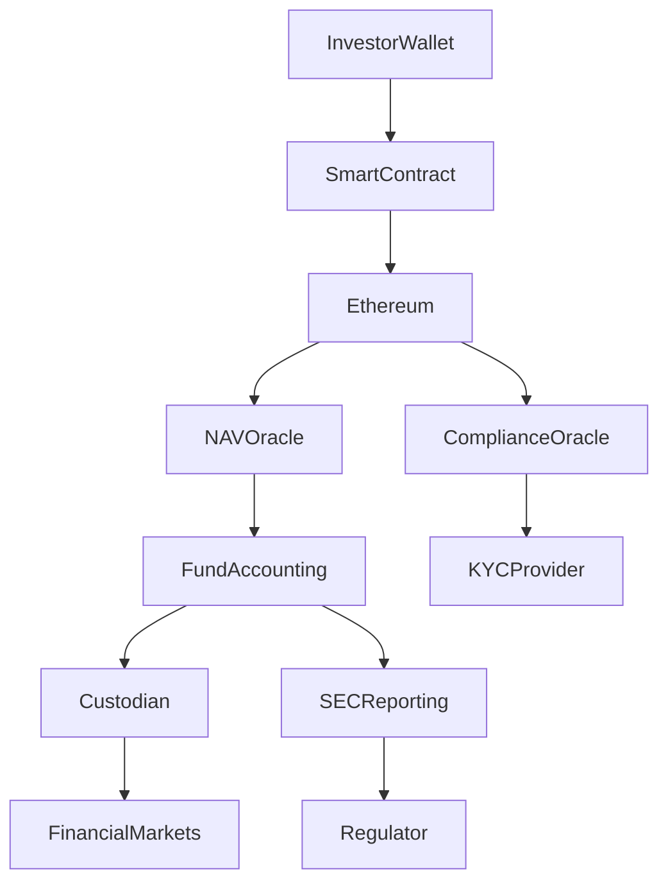

---

# 6. Integration Architecture

An integration layer connects blockchain to institutional systems.

| Function | Description |
|---|---|
Blockchain event monitoring | detect mint/burn/transfer |
Workflow orchestration | subscription/redemption |
Data synchronization | accounting reconciliation |
Regulatory reporting | SEC filings |

---

# 7. Investor Servicing Model

Even if ownership is on-chain, investor servicing must exist.

| Service | Purpose |
|---|---|
Account statements | investor reporting |
Tax reporting | IRS reporting |
Dividend processing | yield distribution |
Customer support | regulatory requirement |

These services are delivered through the investor portal and transfer-agent-like servicing functions.

---

# 8. Investor Lifecycle Flow

## Onboarding

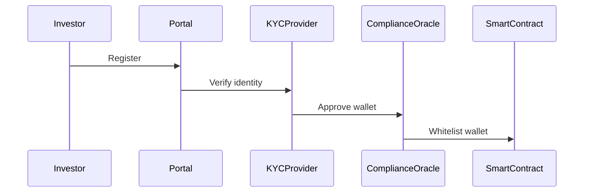

## Subscription

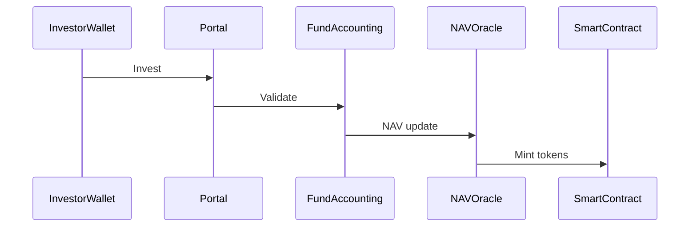

## Transfer

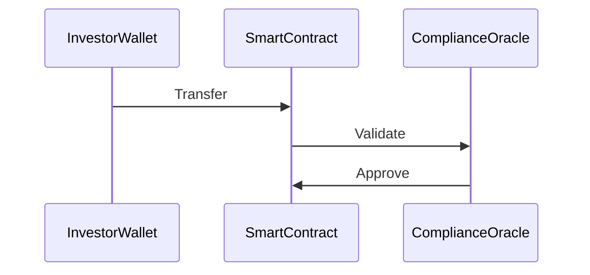

## Redemption

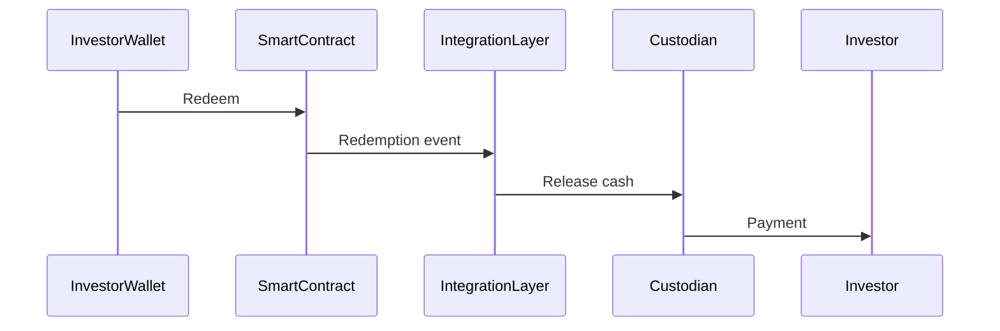

---

# 9. Oracle Infrastructure

| Oracle | Data |
|---|---|
NAV Oracle | daily fund NAV |
Compliance Oracle | investor eligibility |
Liquidity Oracle | liquidity metrics |
Price Oracle | asset valuation |

---

# 10. Operational Monitoring

| Capability | Purpose |
|---|---|
Blockchain analytics | AML detection |
Supply monitoring | token consistency |
Oracle monitoring | detect data errors |
Security monitoring | cyber threat detection |

---

# 11. Governance Model

Smart contract governance must define:

- contract upgrades
- emergency shutdown
- incident response

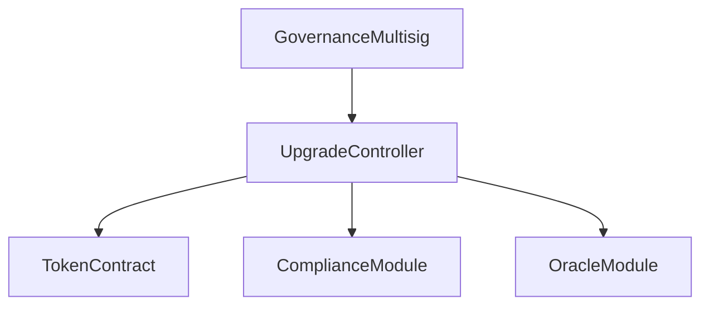

---

# 12. C4 Architecture Model

## C1 — System Context

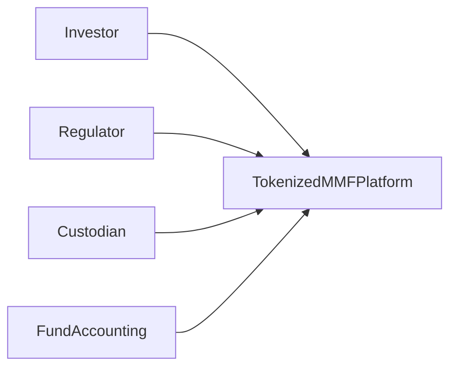

## C2 — Container Diagram

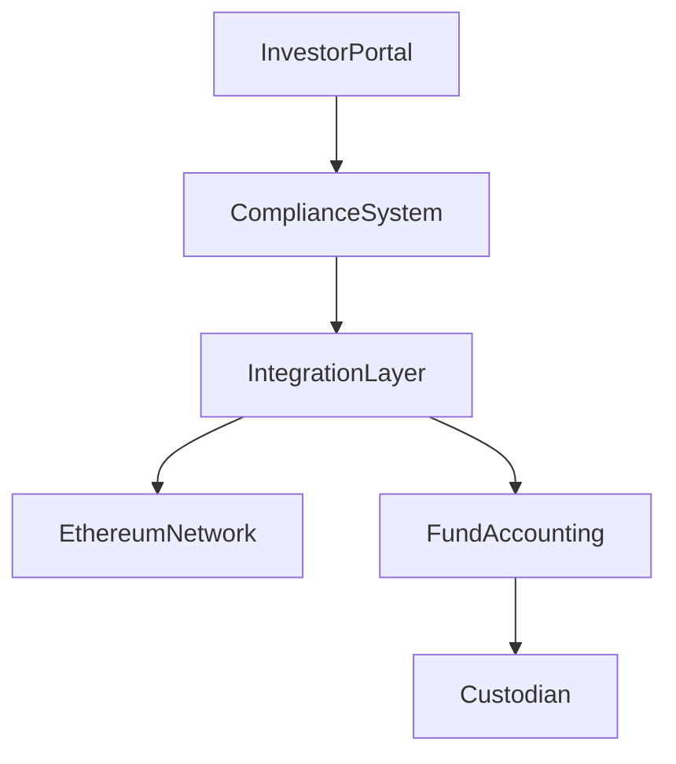

## C3 — Component Diagram

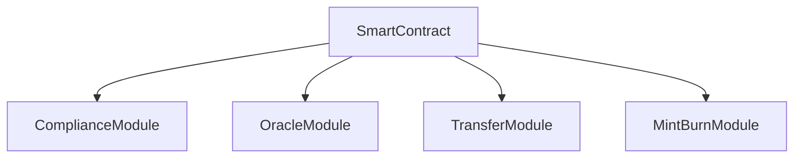

## C4 — Code / Contract Level

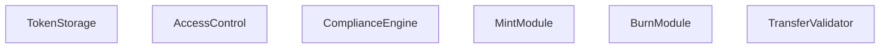

---

# 13. Detailed Smart Contract Architecture

## Core Contract Modules

| Module | Purpose |
|---|---|
Token Ledger | balances and ownership |
Compliance Engine | wallet eligibility |
Mint Module | issue shares |
Burn Module | redemption |
Transfer Validator | enforce rules |
Oracle Adapter | NAV feeds |

## Contract Architecture

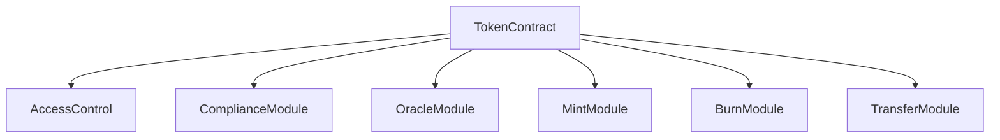

## Smart Contract Roles

| Role | Permissions |
|---|---|
Admin | upgrade contracts |
Issuer | mint tokens |
Redeemer | burn tokens |
Compliance Officer | manage whitelist |
Oracle Operator | update NAV |

---

# 14. Security Model

| Control | Purpose |
|---|---|
Multisig governance | prevent unilateral control |
Contract audits | security validation |
Emergency pause | halt system if needed |

---

# 15. Secondary Market Trading Framework

Tokenized shares may support secondary trading depending on regulatory structure.

## Broker‑Dealer Integration

| Actor | Role |
|---|---|
Broker‑Dealer | execute trades |
ATS | alternative trading system |
Compliance Layer | enforce eligibility |

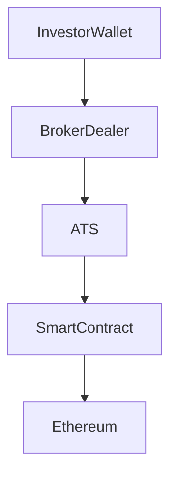

OPTIONAL — ATS Integration

Secondary trading could occur through an Alternative Trading System (ATS).

OPTIONAL — Transfer Restricted Model

Instead of open trading, the platform may enforce restricted transfers.

---

# 16. Build vs Outsource

## Build Internally

- smart contracts
- oracle infrastructure
- integration layer
- compliance monitoring

## Outsource

- custody
- fund accounting
- investor onboarding

---

# 17. Key Risks

| Risk | Description |
|---|---|
Regulatory risk | acceptance of blockchain shareholder register |
Operational risk | smart contract failures |
Compliance risk | wallet identity verification |
Liquidity risk | redemption settlement |

---

# 18. Hybrid Fallback Architecture

If regulators require it, the platform must support fallback to a hybrid architecture.

---

# 19. Architectural Principle

Smart Contract Ledger = Shareholder Register

Traditional systems act as supporting operational infrastructure.

---

# 20. Final Recommendation

A fully on-chain architecture enables:

- real-time ownership
- programmable financial assets
- simplified settlement

However regulatory requirements require integration with:

- SEC reporting systems
- compliance infrastructure
- regulated custodians
- oracle services

to ensure full compliance.

---

# 21. Final Completeness Checklist

✔ SEC regulatory framework  
✔ fund registration requirements  
✔ investor servicing model  
✔ compliance architecture  
✔ oracle infrastructure  
✔ governance model  
✔ integration architecture  
✔ C4 architecture diagrams  
✔ smart contract design  
✔ security model  
✔ secondary trading framework (optional)
