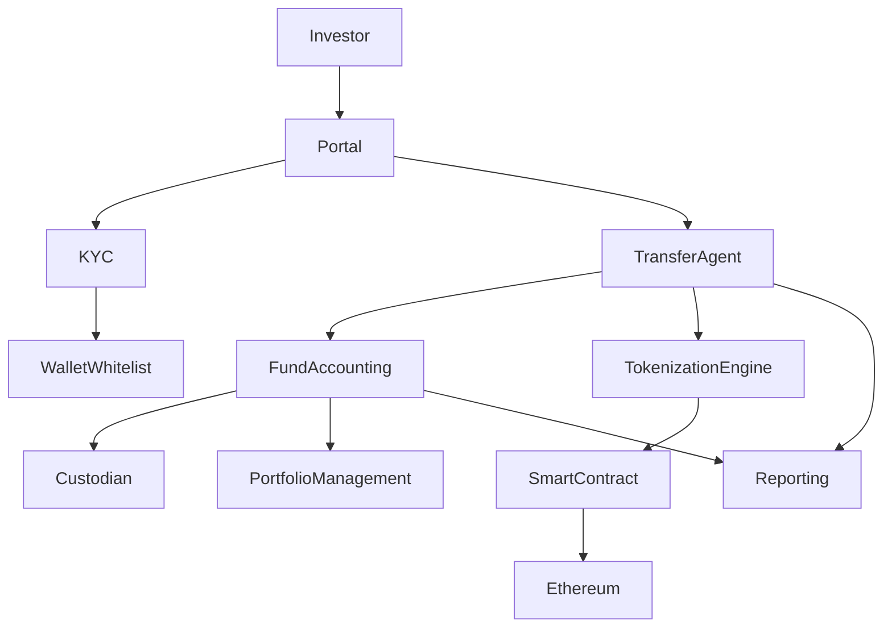
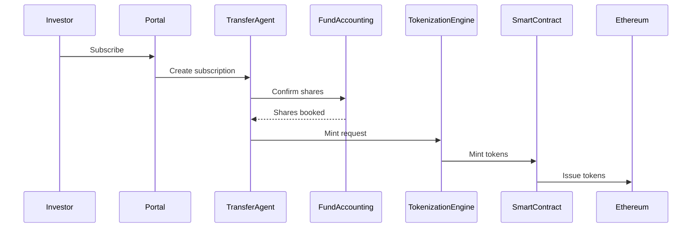
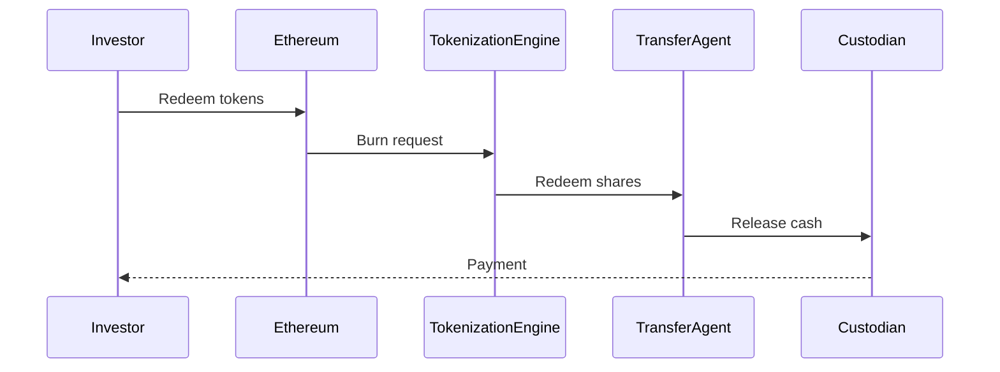

# Tokenized US Money Market Platform
## Mirror Token Architecture (Ethereum)

Version: 1.0  
Audience: Architecture / IT / Business / Legal / Operations  

---

# 1. Executive Summary

This document describes the **target architecture and operational model** for launching a **tokenized US Money Market platform** using **Ethereum**.

The recommended model is a **mirror-token architecture**, where:

- The **official shareholder record remains off-chain** in regulated financial infrastructure.
- The **blockchain token mirrors ownership of the fund shares** on Ethereum.

This approach aligns with institutional models implemented by firms such as BNY Mellon, Goldman Sachs, and Franklin Templeton.

---

# 2. Regulatory Framework

The platform must comply with US investment fund regulations.

Primary regulatory framework:

- SEC Rule 2a-7 (Money Market Funds)
- Investment Company Act of 1940
- Oversight by the U.S. Securities and Exchange Commission (SEC)

Key requirements include:

| Requirement | Description |
|---|---|
Liquidity limits | Daily and weekly liquidity requirements |
Portfolio restrictions | Short-term high-quality assets |
NAV calculation | Daily calculation |
Reporting | SEC reporting obligations |

---

# 3. Mirror Token Concept

Mirror tokens represent **digital ownership of fund shares** but do **not replace the official financial ledger**.

Two ledgers coexist:

| Ledger | Role |
|---|---|
Transfer Agent ledger | Official legal record |
Ethereum token ledger | Digital mirror representation |

---

# 4. Target Architecture

## High Level Architecture



---

# 5. Core Components

## Investor Portal

Provides:

- investor onboarding
- subscription requests
- wallet management

---

## KYC / AML Platform

Handles:

- identity verification
- sanctions checks
- tax classification
- compliance checks

---

## Transfer Agent

The Transfer Agent maintains the **official shareholder record**.

Responsibilities:

- subscriptions
- redemptions
- investor accounts
- official ledger

---

## Fund Accounting

Responsible for:

- NAV calculation
- yield calculation
- portfolio valuation
- liquidity monitoring

---

## Custodian

The custodian holds the underlying assets.

Typical assets include:

- treasury bills
- repos
- commercial paper

---

# 6. Tokenization Extension

## Tokenization Engine

The tokenization engine acts as the **bridge between traditional systems and Ethereum**.

Responsibilities:

- mint tokens
- burn tokens
- manage wallet whitelist
- map investors to wallets

---

## Smart Contract

The token contract represents the **mirror token** deployed on Ethereum.

Typical standards:

- ERC‑20
- ERC‑1400 (Security Token Standard)

Capabilities include:

- mint / burn
- transfer restrictions
- whitelist enforcement

---

## Ethereum Network

Ethereum provides:

- smart contract execution
- immutable transaction ledger
- wallet interoperability
- institutional blockchain ecosystem

---

# 7. Token Minting Flow



---

# 8. Redemption Flow



---

# 9. Reconciliation Engine

A reconciliation service must ensure consistency between ledgers.

Invariant:

```
Official Shares
- Pending Burns
+ Pending Mints
=
Expected Token Supply
```

If mismatches occur:

- mint/burn operations stop
- reconciliation alert triggered

---

# 10. Security and Compliance Controls

Minimum controls required:

| Control | Purpose |
|---|---|
Wallet whitelist | restrict token ownership |
KYC linkage | map wallets to investors |
Transfer restrictions | prevent unauthorized transfers |
Freeze mechanism | stop suspicious transactions |
Audit logging | track mint/burn activity |

---

# 11. Responsibilities (RACI Matrix)

| Activity | Business | Legal | Operations | IT |
|---|---|---|---|---|
Fund structure | A | R | C | C |
Regulatory compliance | C | A | R | C |
Transfer agent selection | A | C | R | C |
Custodian selection | A | C | R | C |
Tokenization design | C | C | C | A |
Blockchain infrastructure | C | C | C | R |
Investor onboarding | C | C | R | C |
Reconciliation controls | C | C | R | A |

Legend:

| Symbol | Meaning |
|---|---|
R | Responsible |
A | Accountable |
C | Consulted |

---

# 12. Build vs Outsource

## Build Internally

- tokenization engine
- reconciliation engine
- wallet compliance service
- integration platform

## Outsource

- transfer agent
- custody
- fund accounting
- regulatory reporting

---

# 13. Implementation Roadmap

## Phase 1 — Regulatory Design

Define:

- fund structure
- legal framework
- transfer agent
- custodian

## Phase 2 — Core Infrastructure

Implement:

- investor portal
- KYC / AML
- transfer agent integration
- fund accounting integration

## Phase 3 — Tokenization Layer

Develop:

- smart contracts
- tokenization engine
- reconciliation system

## Phase 4 — Production Launch

Launch:

- institutional investors
- tokenized shares
- reporting pipeline

---

# 14. Key Architecture Decisions

Three critical decisions must be finalized:

1. Transfer Agent provider
2. Fund accounting provider
3. Token mint/burn trigger events

These decisions determine **most of the platform architecture**.

---

# 15. Final Recommendation

Adopt a **mirror-token architecture on Ethereum**:

- Official shareholder record managed by Transfer Agent
- Ethereum smart contract tokens mirror ownership
- Reconciliation ensures ledger consistency

This approach:

- aligns with regulatory frameworks
- reduces operational risk
- enables digital asset innovation
